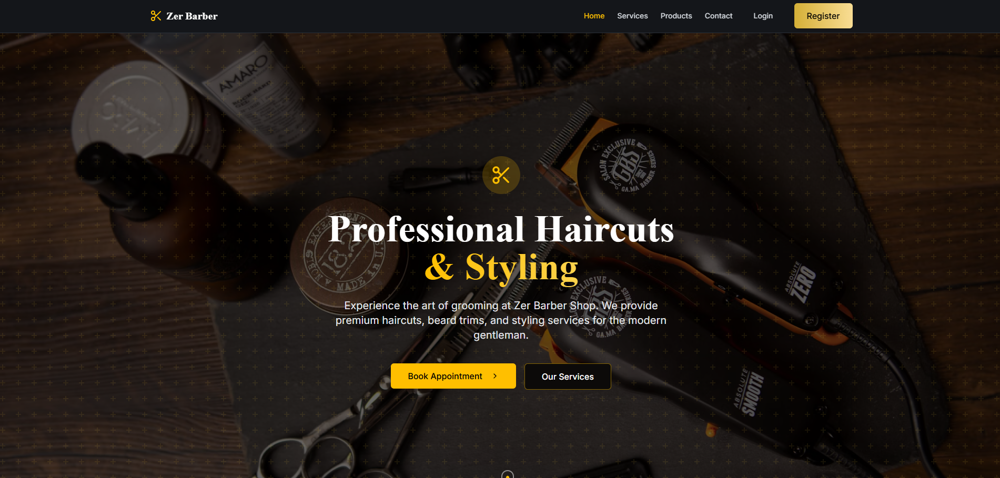

# ✂️ ZerBarberShop

A full-stack web application for a modern barber shop.  
This project was developed as part of my **final thesis (examensarbete)** at **TUC Yrkeshögskola**,  
where I studied **Systemutvecklare .NET** (2023–2025).

The application is built with **C# (.NET Core Web API)** for the backend and **React** for the frontend.  
Frontend design was supported by AI tools, while I focused on developing the backend logic,  
API endpoints, database integration, and ensuring accessibility.

---

## 🖼️ Screenshots

### Home


### Services


### Products


### Register


---

## 🛠️ Tech Stack

- **Frontend**: React, JavaScript, HTML, CSS  
- **Backend**: C# (.NET Core Web API)  
- **Database**: SQLite  
- **Tooling**: Visual Studio Code, npm, Swagger (for API docs)  

---

## 📦 Prerequisites

- [.NET SDK](https://dotnet.microsoft.com/download)  
- [Node.js + npm](https://nodejs.org/)  
- [Visual Studio Code](https://code.visualstudio.com/)  

---

## 🚀 Getting Started

### 1. Clone the repository
```bash
git clone https://github.com/your-username/ZerBarberShop.git
cd ZerBarberShop
````

Start the Backend (.NET)
cd backend
dotnet restore
dotnet build
dotnet run

Start the Frontend (React)
cd frontend
npm install
npm run dev

📌 Features

🔐 User registration & authentication

📅 Booking system for barber services

🛒 Product catalog with shopping cart

📍 Contact form & location map

✅ Responsive & accessible (WCAG-friendly)

📖 About the Project

This project was my examensarbete (final thesis project) during my studies at
TUC Yrkeshögskola – Systemutvecklare .NET (2023–2025).

It demonstrates my ability to:

Design and implement a full-stack solution (frontend + backend + database)

Use C#/.NET Core with SQLite for backend development

Apply accessibility (WCAG) and responsive design principles

Document APIs using Swagger

Collaborate with AI tools for frontend design assistance while ensuring functionality and integration

ℹ️ Notes

Frontend UI was partially created with help from AI tools.

All backend development, database integration, and overall system design were implemented by me.
